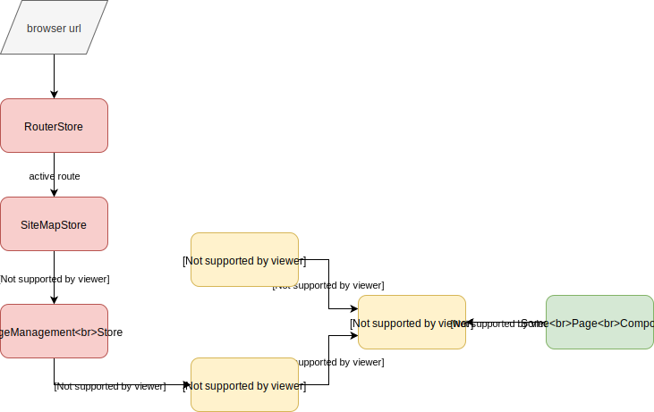

# Page aware dependency injection

In general I would recommend to make your pages as independent from each other as possible. This means you do not have any shared components/stores/state (however you want to call it) except for the bare minimum that the routing framework provides.

However, this can be bad if you actually want to share state between pages (which can be a design decision). For example, think of a custom navigation component that loads data and shows menus with that data. From the selected data it builds the links to route to. If you do not want to build your whole app in one page (you don't) and you do not want to force each page to load the data required for that component (you do not want that either). Then you need to share the state of this component between a (in the best case predefined) set of pages. And we do not want to make a global/module static store to hold the state either.

The simple container that is provided by the rfluxx core framework does not accomodate this notion of page awareness and sharing components between pages. Therefore, a new page aware container and infrastructure must be build that can be used to share state intentionally between specific pages.

## State sharing 101

Here are some very basic points about state sharing

- State is held by stores, so sharing stores, means sharing state
- State could be shared globally (not recommended, or lets say only do this rarely)
- State could be shared between a set of pages 
- State could be only available in one page
- Site map nodes lead to pages
- If you have parameters in your site map node urls, one site map node will lead to multiple pages (one per parameter set that influences the page id creation)

## Specifying a page aware container

There are currently two container factories that a developer can specify

- A global container factory
- A site map node specific container factory



Depending on what url is entered in the browser a route and site map node are computed. From the site map node the correct site map node specific container factory is determined. Finally the container instance is created that can then be used by the components of the page.

As you can see the container instance is created from both the registrations in the global container factory as well as the site map node specific container factory.

By default the classes/stores registered in those factories will be only available to the page for which the container was created. The only difference between the global and site map node specific factory is that you can put common registrations in the global factory once. In the end the created instances will be page specific nevertheless.

Extending on these concepts we want to introduce intentional sharing of state between pages.

Requirements:

- Give a way to specify to whom you want to share something
  - Share to all pages on self
  - Share to children/descendants
  - Share to siblings
  - Share to parent/ancestors
  - Share to someone by id
- Sharing to other site map nodes will always share to all pages on self
- Provide one builder interface that allows for all the options above
- Use the same container interface during resolution time
- 
- Resolution priority goes from nearest to farthest: page itfself, children, siblings, parents (increase level), stranger (by id), global)

The following could be an interface for the builder used in the site map specific container factory.

**Attention: not all of the following methods are imported yet.**

```typescript
// same registration interface as for simple container
builder.register(...).as(...)
       .shareToAllPages()  // share to all pages of this site map node
       .shareToChildren()  // share to all pages whose site map node is a child of the current site map node
       .shareToSibling()  // share to all pages whose site map node is a child of the parent of the current site map node
       .shareToParent()  // share to all pages whose site map node is the parent of the current site map node
       .shareToStranger(id)  // share to a all pages whose site map node has the given id
```

The following could be an interface for the builder used in the global container factory.

```typescript
// same registration interface as for simple container
builder.register(...).as(...)
       .shareGlobally()  // share between all pages on all site map nodes
```

## State management

The main goal of such a container is state management. Being in control of which state is kept and which is thrown away. For large apps this can effectively reduce your memory footprint.

For NON shared registrations we throw away the instances together with the rest of the page. If the page is marked for trashing the complete container holding all of the instances is deleted.

## State management vs state sharing

The main problem with State sharing is: when can a state can be thrown away.

The simple answer: when nobody depends on it anymore.

This is quite a complex thing to achieve because you need to track who is using which state.

Also by sharing instances between many pages the state management could be rendered useless. This can become the case when there is always at least one page using a shared instance.

Therefore, for the time being state management is not applied to shared instances. They will be in memory forever once created.