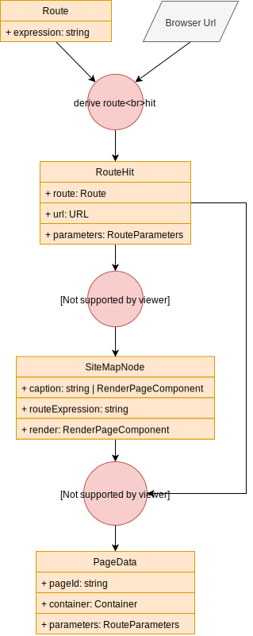

# RFluXX Routing

RFluXX offers a ready made routing solution that comes with the following features:

- define routes including route parameters to match URLs
- define a site map to structure your app
- get an automatic breadcrumb based on the site map you defined
- let your pages state be managed by the integrated state manager
- let your pages communicate by exchanging arbitrary data
    
## Overview

The following image shows the main data structures and computation steps during routing and page navigation.



The trigger for a navigation is always the change of the selected browser url. From the set of available routes and the url the current route hit is computed. For this route hit the parameters in the route expression are extracted from the url.

The next step is to find the matching site map node. The purpose of the site map nodes is to decide how to render a page. They have two properties namely the `caption` and `render` properties that can be used to render a title/short info and the full site map node.

Finally the page data is retrieved based on the url browser url. For this the page id is computed that uniquely identifies a page data object. From the page id a lookup of the page data is attempted. If not available a new page data object is created. It contains the full state of the page e.g. the dependency injection container and url parameters.

The site map node and page data is then used to render the page. The `render` property of the site map node renders the root component of the page and the page container can be used by components of the page to resolve stores for managing page state.

## Routes

Every page that a user can open in your app should have a URL that can be remembered or added to the favorites for later access.
Routes are a mechanism to recognize URL patterns. Once the route for an URL has been determined we can base further decisions on
this information.

__Example__:

This route

    home/user

could match the following URLs

    https://my.domain.com/home/user
    https://my.domain.com/home/user/list
    https://my.domain.com/home/user/create

As you can see the route matches more than just a single path in this app. Therefore you will usually have several routes that match more and more specific URL paths.

For the example above we could add two more routes:

    home/user
    home/user/list
    home/user/create
    
With these three routes we can almost distinguish between the three URL patterns given above. The only thing that must be guaranteed is that the routes are matched from more to less specific e.g. in the following order:

    home/user/create
    home/user/list
    home/user
    
### Route parameters

Routes can also have parameters that can be used to configure the UI shown for the route.

    home/{entityName}/list
    
This route has a parameter `entityName` and could match the following URL fragments:

    home/user/list: entityName = user
    home/setting/list: entityName = setting
    home/address/list: entityName = address
    
## Site Map

A site map is a tree that describes the structure of your app in terms of different pages that are shown to the user. It helps the user understand how to navigate between the different pages.

But it can also help in describing the structure of your page to your routing framework. ;)

Therefore RFluXX allows you to define a site map from which the UI is created that should be down to the user.

### Site Map Nodes

Each site map is a tree of so called site map nodes. The nodes contain the following information:

- caption of the node
- the route and parameter values to which the site map node applies
- instructions on how to create the UI content for the page of this site map node
- child site map nodes

### Breadcrumb

Based on the tree structure of the site map we can automatically derive a breadcrumb path that can be shown to the user. Such a breadcrumb makes orientation much easier for the user.

It is as simple as joining the captions of the site map nodes in the active path.

## Pages

Pages are an layer on top of the site map node system that introduces state management for the different site map nodes. You can say that a site map node can be mapped to one or several pages. Each page has completely separate state from all other pages.

### Page Id

The mapping of site map nodes to pages is based on a page id algorithm that computes which urls belong to one page. 

#### Default page id algorithm

The default page id algorithm computes the page id as the path and search of the url that was navigated to. 

This means that the path and all search parameters influence the page id. 

You can also ignore certain search parameters from the page id.

`index.tsx`
```typescript
//...

const globalStores = RfluxxRouting.init({
    siteMap,
    containerFactory,
    pageIdOptions: {
        // here you can define to ignore certain parameters
        // for the page id computation
        ignoredParameters: ["param1", "param2"]
    }
});

//...
```

#### Custom page id algorithm

If you want to you can create your own page id algorithm. 

### Page state

One very important aspect of routing in react apps is the management of state for inactive pages.

In RFluXX state is saved in the different stores. This state must be persisted when navigating to a different page. When navigating back the last state should be available again. This is especially important for longer edit workflows that navigate forth and back between different edit pages.

Also stores should be reusable across pages and the creation of stores should not overlap in different pages. This should be even the case when the developer is ignorant of this fact. Imagine a case where two pages use the same store but for totally different data sets. The state and configuration for the stores in the two pages must be different. But they must be retrievable as long as the pages are active.

### Page communication

Another important feature that is closely related to routing is the communication between pages.

Imagine for example the opening of a new page to select/create data that should be used in the previous page.
We need a mechanism to open the second page from the first page and to retrieve the result data that the second page created.

For more info on this topic see [Forms of navigation](navigation_forms.md)